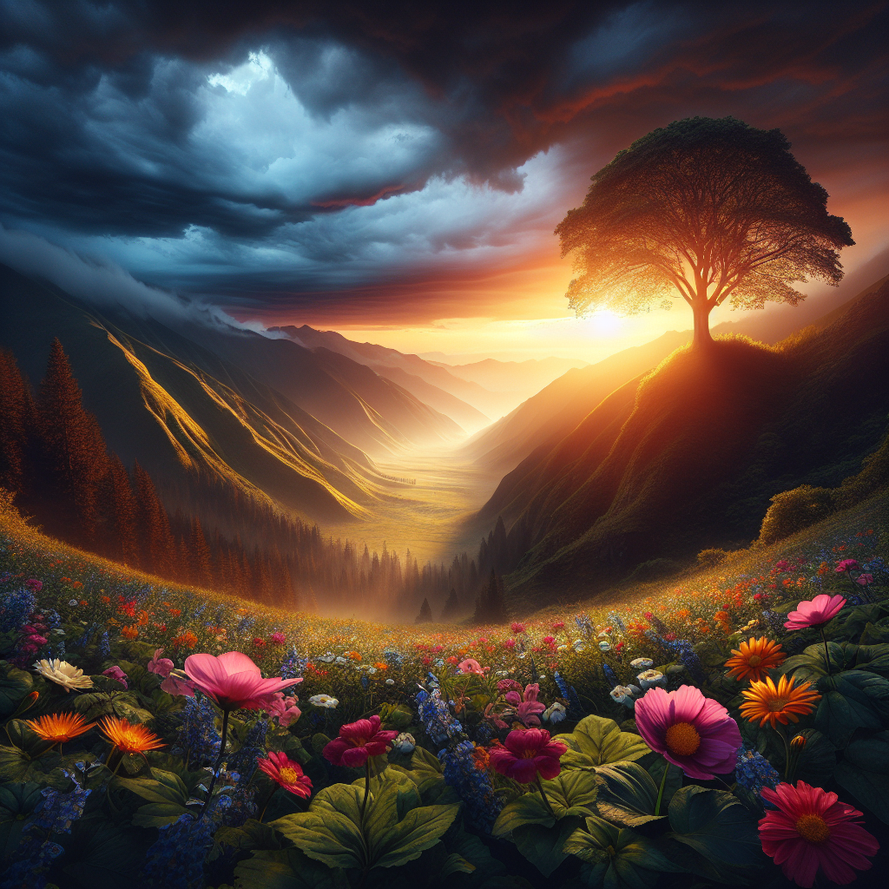
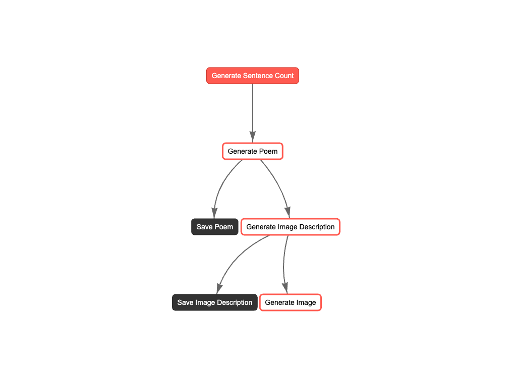

# CrewAI Flow Example

Welcome to the CrewAI Flow Example Crew project, powered by [crewAI](https://crewai.com). This template is designed to help you set up a multi-agent AI system with ease, leveraging the powerful and flexible framework provided by crewAI. Our goal is to enable your agents to collaborate effectively on complex tasks, maximizing their collective intelligence and capabilities.

## Installation

Ensure you have Python >=3.10 <=3.13 installed on your system. This project uses [UV](https://docs.astral.sh/uv/) for dependency management and package handling, offering a seamless setup and execution experience.

First, if you haven't already, install uv:

```bash
pip install uv
```

Next, navigate to your project directory and install the dependencies:

(Optional) Lock the dependencies and install them by using the CLI command:
```bash
crewai install
```

### Customizing

**Add your `OPENAI_API_KEY` into the `.env` file**

- Modify `src/example_flow/config/agents.yaml` to define your agents
- Modify `src/example_flow/config/tasks.yaml` to define your tasks
- Modify `src/example_flow/crew.py` to add your own logic, tools and specific args
- Modify `src/example_flow/main.py` to add custom inputs for your agents and tasks

## Running the Project

To kickstart your crew of AI agents and begin task execution, run this from the root folder of your project:

```bash
crewai run
```

This command initializes the example_flow Crew, assembling the agents and assigning them tasks as defined in your configuration.

This example, unmodified, will run the create a `report.md` file with the output of a research on LLMs in the root folder.

## Understanding Your Crew

The example_flow Crew is composed of multiple AI agents, each with unique roles, goals, and tools. These agents collaborate on a series of tasks, defined in `config/tasks.yaml`, leveraging their collective skills to achieve complex objectives. The `config/agents.yaml` file outlines the capabilities and configurations of each agent in your crew.

## Support

For support, questions, or feedback regarding the CrewAI Flow Example Crew or crewAI.

- Visit our [documentation](https://docs.crewai.com)
- Reach out to us through our [GitHub repository](https://github.com/joaomdmoura/crewai)
- [Join our Discord](https://discord.com/invite/X4JWnZnxPb)
- [Chat with our docs](https://chatg.pt/DWjSBZn)

Let's create wonders together with the power and simplicity of crewAI.

---

### Introduction

AI is changing how we approach creativity and workflows. In this blog, I’ll walk through a project using [CrewAI's Flow](https://docs.crewai.com/concepts/flows#introduction)— a recent feature released designed to streamline the management of AI workflows allowing structured and event-driven workflows. Together, we'll create a collaborative flow involving multiple CrewAI agents to craft a poem, generate a vivid image description, and ultimately bring the poem to life with artwork.
### Create The Flow

We’re starting simple by creating a flow using CrewAI’s default template. This initial setup provides a `poem_crew` that includes an `agent` and a `task` for writing a poem. Let’s get started by creating a new flow with the following command:

```bash
crewai create flow name_of_flow
```

This command sets up a base flow with a `poem_crew`. The default configuration includes the following agent and task in `tasks.yaml` and `agent.yaml`:

#### Tasks Configuration

```yaml
# tasks.yaml
write_poem:
  description: >
    Write a poem about how CrewAI is awesome.
    Ensure the poem is engaging and adheres to the specified sentence count of {sentence_count}.
  expected_output: >
    A beautifully crafted poem about CrewAI, with exactly {sentence_count} sentences.
  agent: poem_writer
```

#### Agent Configuration

```yaml
# agent.yaml
poem_writer:
  role: >
    CrewAI Poem Writer
  goal: >
    Generate a funny, lighthearted poem about how CrewAI 
    is awesome with a sentence count of {sentence_count}.
  backstory: >
    You're a creative poet with a talent for capturing the essence of any topic
    in a beautiful and engaging way. Known for your ability to craft poems that
    resonate with readers, you bring a unique perspective and artistic flair to
    every piece you write.
```

This setup generates a `poem_crew` flow in `main.py` using a structured state management approach to create a poem. Here’s what the code looks like:

```python
class PoemState(BaseModel):
    sentence_count: int = 1
    poem: str = ""
    image_description: str = ""

class PoemFlow(Flow[PoemState]):
    @start()
    def generate_sentence_count(self):
        print("Generating sentence count")
        self.state.sentence_count = randint(3, 5)

    @listen(generate_sentence_count)
    def generate_poem(self):
        print("Generating poem")
        result = (
            PoemCrew()
            .crew()
            .kickoff(inputs={"sentence_count": self.state.sentence_count})
        )

        print("Poem generated", result.raw)
        self.state.poem = result.raw

    @listen(generate_poem)
    def save_poem(self):
        print("Saving poem")
        with open("poem.txt", "w") as f:
            f.write(self.state.poem)
```

This initial flow provides the foundation for expanding into more complex setups.
### Expanding on the Template

Now, let’s expand on the flow by adding more crews. Beyond writing a poem, we want to generate an image description that captures the essence of the poem and create a visual representation using [DALLE tool](https://docs.crewai.com/tools/dalletool#dall-e-tool).

For simplicity, this example focuses on experimenting with [Structured State Management](https://docs.crewai.com/concepts/flows#structured-state-management-2), and CrewAI integration of 3 Crews. 

>Tip: As a best practice, breaking tasks into specialized crews ensures better results, as explained by CrewAI's founder [João Moura](https://x.com/joaomdmoura) in this [video](https://youtu.be/KAsrbqJ8yas?t=328).

If we were to expand further and create a more complex flow, we could add:

- A blogging crew to write articles about the poem and the image.
- A social media content creator crew to write posts about the blog.
- A news letter creator crew to write an email about the blog and posts.
- A review agent for quality checks in each crew.
- A distribution crew for sending out the newsletter and posting the content on social media accounts via APIs.

These are just a few ideas of how this simple setup could evolve more into a complex event driven flow, not to mention adding in [Flow Control](https://docs.crewai.com/concepts/flows#flow-control) with conditional logic functions `or_` and `and_`.
### Create New Crews

To create a new crew, use the command:

```bash
crewai flow add-crew <crew_name>
```

I added two new crews: an `image_crew` for describing images and a `dalle_crew` for generating visuals. Here’s the configuration for these crews:
#### Image Crew

```yaml
# image crew agent
image_describer:
  role: >
    Senior Visual Data Analyst
  goal: >
    Provide detailed and accurate descriptions of images to support an artist 
    in generating visuals.
  backstory: >
    You have a strong background in visual analysis and a keen eye for detail,
    known for capturing the essence of visual scenes.

# image crew task
image_describer_task:
  description: >
    Analyze the poem and create a vivid, accurate description for an image,
    focusing on objects, colors, textures, and context.
  expected_output: >
    A detailed description of the image, capturing its main elements and atmosphere.
  agent: image_describer
```

#### DALLE Crew

```yaml
# dalle crew agent
artist:
  role: >
    Creative Director
  goal: >
    Create visually appealing and meaningful artwork that communicates the theme and engages audiences.
  backstory: >
    You're a creative artist passionate about transforming ideas into engaging visuals,
    known for your ability to evoke emotions through art.

# dalle crew task
artist_task:
  description: >
    Create artwork based on provided themes and guidelines to communicate the intended message.
  expected_output: >
    An original artwork that aligns with the poem's theme and captures its essence.
  agent: artist
```

>Tip: Read more about how to create  <a href="https://www.marcusandrewlee.com/posts/multi-ai-agent-systems-with-crewai-framework/#section-16" target="_blank">effective agents</a> .  
### Connect the Crews to the Flow

We expanded the `PoemFlow` to include the new crews and connected them to the flow steps using the `@listen` decorator. Each crew's tasks build on the previous step, updating the flow state as follows:

1. **Generate Sentence Count:** Determines the number of sentences in the poem.
2. **Generate Poem:** Writes the poem using `poem_crew`.
3. **Generate Image Description:** Describes an image based on the poem using `image_crew`.
4. **Generate Image:** Creates an image from the description using `dalle_crew`.

Here’s the updated flow:

```python
@listen(generate_poem)
def generate_image_description(self):
    print("Generating image description")
    description = ImageCrew().crew().kickoff(inputs={"poem": self.state.poem})
    print("Image description generated", description.raw)
    self.state.image_description = description.raw

@listen(generate_image_description)
def generate_image(self):
    print("Generating image")
    image = (
        DaleCrew()
        .crew()
        .kickoff(inputs={"description": self.state.image_description})
    )
    print("Image generated")
    with open("image.txt", "w") as f:
        f.write(image.raw)
```

Finally, we added a visualization of the flow:

```python
poem_flow.plot("my_plot_flow")
```

Here is the full code:
```python
#!/usr/bin/env python
from random import randint

from pydantic import BaseModel

from crewai.flow.flow import Flow, listen, start

from example_flow.crews.poem_crew.poem_crew import PoemCrew
from example_flow.crews.image_crew.image_crew import ImageCrew
from example_flow.crews.dale_crew.dale_crew import DaleCrew


class PoemState(BaseModel):
    sentence_count: int = 1
    poem: str = ""
    image_description: str = ""


class PoemFlow(Flow[PoemState]):
    @start()
    def generate_sentence_count(self):
        print("Generating sentence count")
        self.state.sentence_count = randint(3, 5)

    @listen(generate_sentence_count)
    def generate_poem(self):
        print("Generating poem")
        result = (
            PoemCrew()
            .crew()
            .kickoff(inputs={"sentence_count": self.state.sentence_count})
        )

        print("Poem generated", result.raw)
        self.state.poem = result.raw

    @listen(generate_poem)
    def save_poem(self):
        print("Saving poem")
        with open("poem.txt", "w") as f:
            f.write(self.state.poem)

    @listen(generate_poem)
    def generate_image_description(self):
        print("Generating image description")
        description = ImageCrew().crew().kickoff(inputs={"poem": self.state.poem})
        print("Image description generated", description.raw)
        self.state.image_description = description.raw

    @listen(generate_image_description)
    def save_image_description(self):
        print("Saving image description")
        with open("image_description.txt", "w") as f:
            f.write(self.state.image_description)

    # Generate Image using DALE
    @listen(generate_image_description)
    def generate_image(self):
        print("Generating image")
        image = (
            DaleCrew()
            .crew()
            .kickoff(inputs={"description": self.state.image_description})
        )
        print("Image generated")
        with open("image.txt", "w") as f:
            f.write(image.raw)


def kickoff():
    poem_flow = PoemFlow()
    poem_flow.kickoff()
    poem_flow.plot("my_plot_flow")


if __name__ == "__main__":
    kickoff()
```

### Result

When I ran the flow using:

```bash
crewai flow kickoff
```

Here’s what I got:

#### Poem

**Poem Crew Response:**  
Oh CrewAI, you clever little sprite,  
Crafting words that dance like stars at night,  
With laughter and wisdom, you make us gleam,  
In the world of AI, you reign supreme!

#### Poem Image Description

**Image Description Crew Response:**  
The image to illustrate the poem shall be rich in elements that evoke deep emotions and a reflective mood. Picture a tranquil landscape at dawn, where soft hues of pastel pink and orange blend seamlessly into the soft blue of the awakening sky. The sun, a gentle golden orb, peeks just above the horizon, casting a warm glow across the scene.  

In the foreground, a still lake mirrors the sky, its surface a glassy canvas reflecting the soft colors and a few fluffy clouds. Surrounding the lake are lush green meadows sprinkled with wildflowers, their vibrant colors—yellows, purples, and whites—adding a touch of vibrant life to the serene tapestry. The texture of the flowers appears delicate yet vibrant, fluttering gently in a soft breeze.  

Near the edge of the lake, a single willow tree stretches its long, slender branches, which dance playfully in the wind. The trunk is sturdy and gnarled, giving a sense of timelessness. The leaves shimmer in varying shades of green, from deep jade to soft lime, adding depth and richness to the color palette.  

On the opposite side of the lake, a quaint wooden dock juts out over the water, its surface worn and weathered, hinting at years of history. A small rowboat is tethered at the end of the dock, its bright blue paint slightly peeling, suggesting stories of adventures and quiet reflections.  

In the background, rolling hills covered in a tapestry of green and gold rise gently against the horizon, their undulating curves adding a sense of peacefulness to the landscape. The light casts soft shadows that enrich the scene, creating a harmonious balance between light and dark.  

Overall, the image captures a moment of tranquility, inviting the viewer to pause and reflect, much like the contemplation found within the lines of the poem. Each element—color, texture, and context—comes together to form a vivid representation that resonates with the themes of peace, introspection, and the beauty of nature.

#### Artwork

**DALLE Image Crew Response:**  
Here is the artwork based on the theme of resilience and hope in nature: 



This piece features a vibrant sunrise over a valley, with blooming flowers and a sturdy tree standing against a stormy backdrop, encapsulating the essence of overcoming challenges and the beauty of nature. The colors are bright and uplifting, designed to engage viewers and convey a powerful message of hope and renewal.

#### Plot



### Conclusion

In this post, we explored how to use CrewAI's Flow framework to orchestrate multiple AI agents and create a cohesive workflow. Starting with the default `poem_crew`, we crafted a poem that highlighted CrewAI's awesomeness. Then, we expanded the flow by adding an `image_crew` to generate a detailed image description and a `dalle_crew` to bring that description to life with visually engaging artwork. Each crew focused on a specific task, demonstrating the power of modular workflows and state management in AI-driven projects.

This example provided a glimpse into the possibilities of CrewAI, but there’s so much more we can do to enhance this setup. Here are a few ideas for making it more complex with events and  flow control for real world use case:

- **Quality Control:** Add review crews to assess and refine outputs at each stage, ensuring the highest quality results.
- **Content Creation Expansion:** Introduce crews for writing accompanying blogs, creating social media posts, or even drafting emails to distribute the generated content.
- **Automation:** Integrate APIs to automate distribution, such as posting the poem, image, and story to social media platforms or sending them via email newsletter.
- **Multimodal Collaboration:** Expand with additional agents for tasks like video creation, and audio narration. 
- **Dynamic User Inputs:** Allow users to customize themes, styles, or parameters to influence the outputs generated by the agents.
- **Performance Tracking:** Add logging or analytics to evaluate the efficiency and effectiveness of each crew and task.

By breaking tasks into specialized crews, you can achieve highly focused, scalable workflows for any project or web apps. Whether for artistic, operational, or technical purposes, this modular approach ensures flexibility and adaptability for tackling even the most complex setups.
